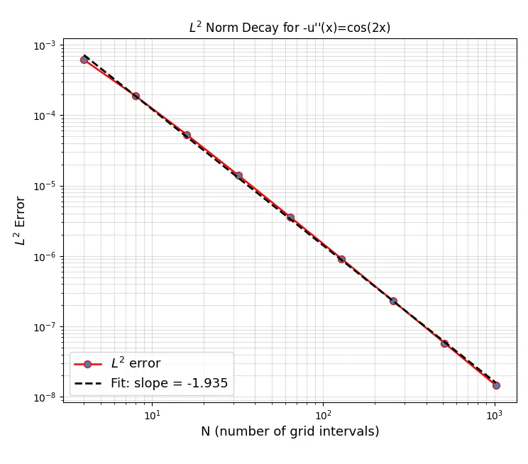

# Numerical PDE

**1. Introduction**

This folder contains a revision of the convergence program in [_01_bvp](../_01_bvp/) implemented in Python for the second problem in [2]

---

**2. Problem Statement**

$$
\begin{cases} 
-u''(x) = \cos(2x), & x \in (0, 1), \\ 
u(0) = 3, \\ 
u(1) = 3. 
\end{cases}
$$

---
**3. Analytical Solution**

$u''(x)=-cos(2x)$

$u'(x)=-\int cos(2x)dx$

$u'(x) = -\frac{sin(2x)}{2}+c_1$

$u(x)=-\int (\frac{sin(2x)}{2}+c_1)dx$

$$u(x)=\frac{cos(2x)}{4}+c_1x+c_2$$

at $u(0)=3$:

$$u(0)=\frac{cos(0)}{4}+c_2=3; c_2=\frac{11}{4}$$

at $u(1)=3:$

$$u(1)=\frac{cos(2)}{4}+c_1+\frac{11}{4}=3;c_1=\frac{1-cos(2)}{4}$$

Solution:

$$u(x) = \frac{1}{4}[cos(2x)(1-cos(2)x+11]$$

---

**4. Numerical Implementation**

For $N$ interior grids in [0,1]: $h=\frac{1}{N+1}$

full grid: 

$$x_i=ih;(i=0,...,N+1)$$

$$x_0=0;x=1$$

interior unknowns: $x=(x_1,...,x_N)$

$$u''(x) = \frac{u_{i-1}-2u_i+u_{i+1}}{h^2}$$

**linear system**

$$A\vec{u}=\vec{f}$$

where: $\vec u=(u_1,...,u_N)^T$ and $\vec f=(cos(2x_1),...,cos(2x_N))^T$ 

$$
A =\frac{1}{h^2}
\begin{bmatrix}
2 & -1 & 0 & 0 & \cdots & 0 \\
-1 & 2 & -1 & 0 & \cdots & 0 \\
0 & -1 & 2 & -1 & \cdots & 0 \\ 
\vdots & \vdots & \vdots & \vdots & \ddots & -1 \\
0 & 0 & 0 & 0 & -1 & 2
\end{bmatrix}
$$

---

**5. Results**

_Figure 1: Error convergence plot from [python script](src/pde_sol_.py) (source: Author, 2026)_

---
**6. Interpretation** 

---
# References
[1] [Zhang, R. (2020). *18.085/18.0851 Computational Science and Engineering I: Week 2 Lecture Notes*. Massachusetts Institute of Technology, OpenCourseWare.](https://ocw.mit.edu/courses/18-085-computational-science-and-engineering-i-summer-2020/resources/mit18_085summer20_lec_w2/)

[2] [Zhang, R. (2020). *18.085/18.0851 Computational Science and Engineering I: Homework 2*. Massachusetts Institute of Technology, OpenCourseWare.](https://ocw.mit.edu/courses/18-085-computational-science-and-engineering-i-summer-2020/resources/mit18_085summer20_ps2/)

