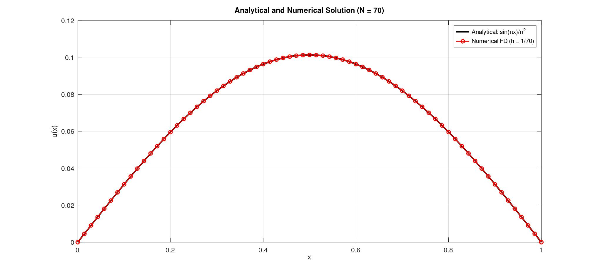
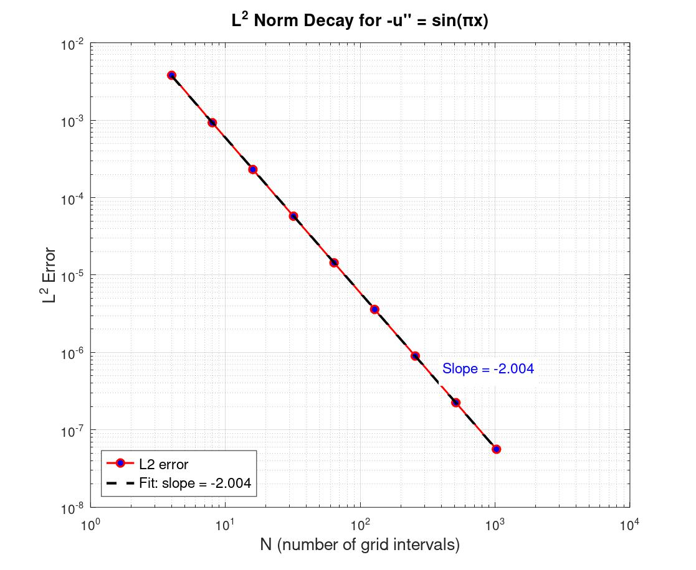

The programs in this folder compute the solution to the boundary value problem:

$$
\begin{cases} 
-u''(x) = f(x) = \sin(\pi x), & x \in (0, 1), \\ 
u(0) = 0, \\ 
u(1) = 0. 
\end{cases}
$$

The analytical solution is: 

$$ \vec{v} = \left( \frac{\sin(x_1\pi)}{\pi^2}, \frac{\sin(x_2\pi)}{\pi^2}, \ldots, \frac{\sin(x_N\pi)}{\pi^2} \right)^T $$

The boundary value problem solver [sol\_.m](src/sol_.m) dicretises the $N$ interior grid points produces and solves the tridiagonal system $A\vec{u} = \vec{f}$ plots the numerical and analytical solutions.

The discrete error between the numerical and analytical solutions obeys $\text{error}_2 \propto N^{-2}$, so the method is second-rder convergent. 

This is confirmed visually: as the log-log plot gives a straight line with slope -2. 

  
The two Octave programs [sol\_.m](src/sol_.m) and [conv_.m](src/conv_.m) reproduce figures in Section 2.1.3 (Convergence Analysis) of the MIT course notes. 

---
# Reference
[1] Zhang, R. (2020). *18.085/18.0851 Computational Science and Engineering I: Week 2 Lecture Notes*. Massachusetts Institute of Technology, OpenCourseWare.

