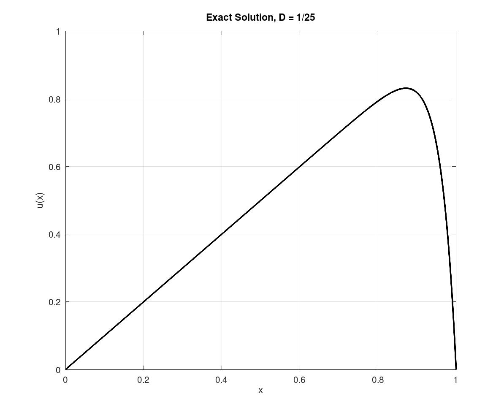

# Convection-Diffusion Boundary Layer Analysis 
---
This folder conains a numerical and analytical solutions to the 1D convection-diffusion equation:

$$-Du''+u'=1$$

under the Dirichlet boundary conditions:

$$u(0) = 0$$ $$u(1) = 0$$

When the coefficient D is very small, $$D = \frac{1}{2}$$, as in this case, the term $u'$ dominates. This causes a region of rapid change near $x=1$

The exact solution is

$$u(x) = x - \frac{e^{x/D-1}}{e^{1/D}-1}$$

Figure 1: Exact solution $u(x)$ for $D = \frac{1}{25}$. The rapid change near $x = 1$ is the boundar layer caused by convection dominance.

